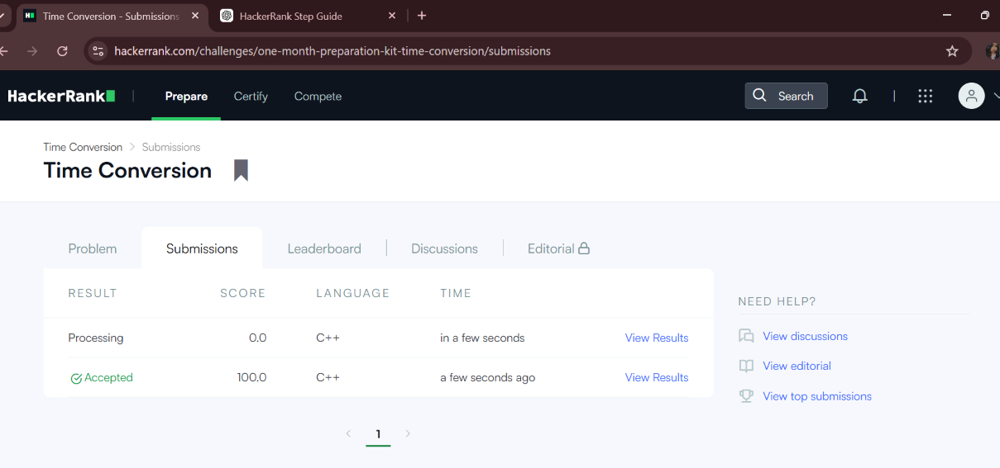
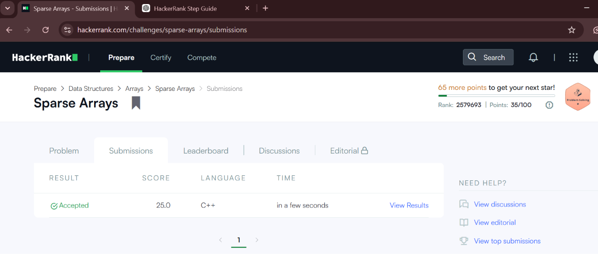

# HackerRank 3rd Semester Portfolio

## Student Information

**Name:** PREKSHITA  
**Course:** B.Tech Computer Science and Engineering  
**Semester:** 3rd Semester  
**University:** REVA University  

## HackerRank Profile

**HackerRank Profile:**  
https://www.hackerrank.com/profile/prekshiktaninne1

## Problems Completed

### 1. Diagonal Difference

**Topic:** 2D Arrays / Matrices

**Time Complexity:** O(N)

**Space Complexity:** O(1)

### 2. Dynamic Array

**Topic:** Data Structures / Vectors

**Time Complexity:** O(N + Q)

**Space Complexity:** O(N)

### 3. Time Conversion

**Topic:** Strings & Logic

**Time Complexity:** O(1)

**Space Complexity:** O(1)

### 4. Compare the Triplets

**Topic:** Basic Implementation

**Time Complexity:** O(1)

**Space Complexity:** O(1)

### 5. Sparse Arrays

**Topic:** Hash Maps / Strings

**Time Complexity:** O(N + Q)

**Space Complexity:** O(N)

## Complexity Analysis

| Problem | Time Complexity | Space Complexity |
|---|---|---|
| Diagonal Difference | O(N) | O(1) |
| Dynamic Array | O(N + Q) | O(N) |
| Time Conversion | O(1) | O(1) |
| Compare the Triplets | O(1) | O(1) |
| Sparse Arrays | O(N + Q) | O(N) |

## HackerRank Accepted Submissions

### Diagonal Difference

### Dynamic Array

### Time Conversion

### Compare the Triplets

### Sparse Arrays

## HackerRank Badge

## Conclusion

This activity helped me improve my problem-solving skills, algorithmic thinking, data structure knowledge, and understanding of time and space complexity. I also learned how to organize programming solutions and document them using GitHub.
